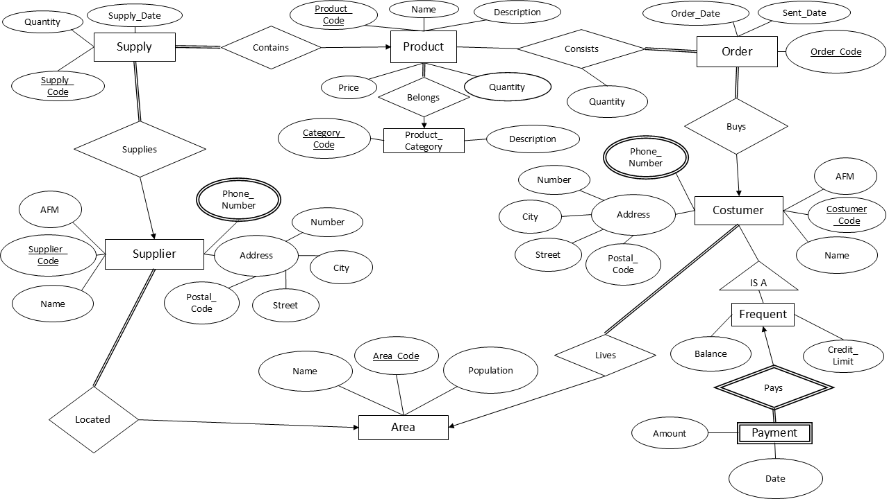
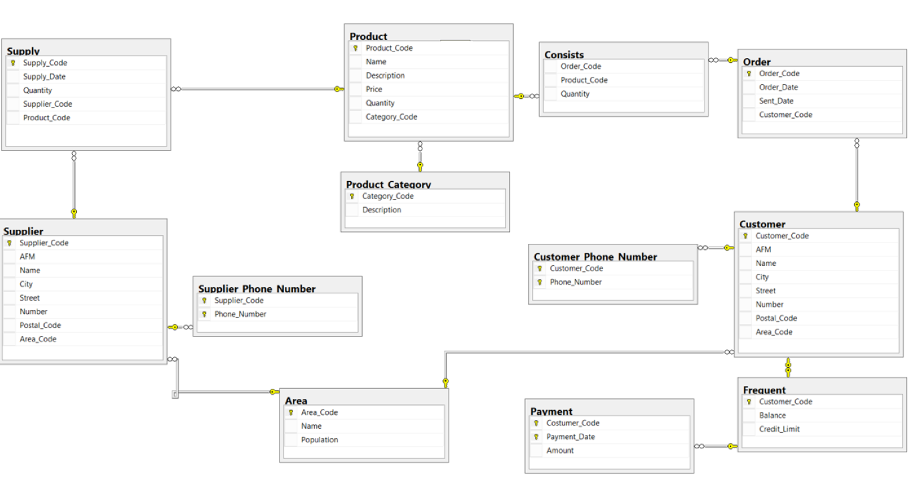

# Sales Database

### **Overview**
This project aims to create a relational database to manage a company's sales data. The database is designed to store information about products, customers, suppliers, orders, and payments. The goal is to experiment with queries in order to expand my knowleadge in SQL and database handling.

### **Problem Desription**
The company is seeking to develop a system to track its inventory. It provides customers with a variety of products sourced from multiple suppliers. Each product has a unique code, name, description, price, and quantity in stock. Suppliers are identified by their code, tax identification number, company name, address, phone number, and other details. Products may be sourced from multiple suppliers. Purchase orders include details such as shipment code, supplier, product, date, and quantity. Products belong to specific categories, each with a unique code and description.

Products are sold to customers, who are identified by a code, company name, tax identification number, address, and phone number. Certain customers, known as "frequent" customers, may have credit limits and outstanding balances. These customers can make payments at their convenience. Both customers and suppliers must be associated with a specific geographic region, which is identified by a code, name, and population.

Customers place orders, which are identified by a code, order date, and shipping date. An order consists of multiple products along with their quantities.

### **Database Schema**

ER model                   |  Database Diagram
:-------------------------:|:-------------------------:
   |  

### **Query Types Utilized**

* **Simple SELECT queries:** Used to retrieve basic information from tables, such as customer data, order details, and product information.
* **JOIN queries:** Combine data from multiple tables to provide more comprehensive insights. For example, joining customer, order, and product tables to analyze sales by customer.
* **Aggregate functions:** Employed to calculate summary statistics, such as `SUM`, `AVG`, `COUNT`, and `MIN`/`MAX`. These functions are used to analyze sales totals, averages, and identify trends.
* **GROUP BY and HAVING clauses:** Used to group data by specific criteria and filter the results based on conditions. For example, grouping sales data by month and filtering for months with total sales above a certain threshold.
* **Subqueries:** Nested queries within a main query to provide more complex calculations or filtering. Subqueries are used in various scenarios, such as calculating average sales for previous months.
* **Views:** Virtual tables that represent the result of a query. Views can be used to simplify complex queries, provide data security, and improve query performance.
* **Stored procedures:** Reusable blocks of code that can be parameterized and executed multiple times. Stored procedures are used to encapsulate common operations and improve efficiency.
* **Cursors:** Used to iterate through result sets row by row, allowing for more granular processing of data. Cursors are employed in stored procedures to perform specific actions on each row.

### **Java Application**

The provided Java code demonstrates a sample application that connects to the database and executes functionalities like:

* Deleting a customer: Uses a DELETE statement to remove a customer record based on the provided Customer_Code.
* Printing a receipt: Uses a SELECT statement with JOIN operations to retrieve customer information, order details, product descriptions, quantities, and calculates the total price. It utilizes ResultSetMetaData to dynamically display the column names and retrieves data from the result set.

